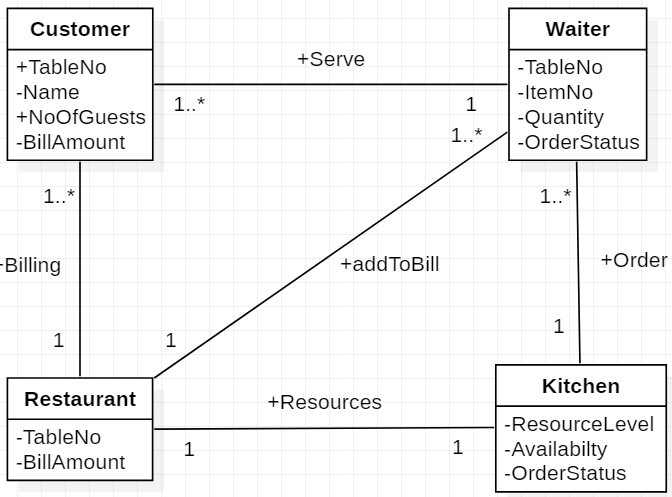

# Restaurant-Management
# Case Study on Restaurant Management using JAVA.

## Classes of the Case Study

| **Object** | **State** | **Behavior** |
| --- | --- | --- |
| **Waiter** | TableNo ItemNo Item Name Quantity Availability Order Status Feedback | SearchItem()   ConfirmOrder()   SetOrderStatus()   AddToBill()   GetFeedback() |
| **Customer** | Reservation ID Name TableNo NumberOfGuests OrderItems Bill | SearchItem()   OrderItem()   PlaceBill() |
| **Menu** | Cuisine Type Name Recipe Price | GetAvailability()|
| **Kitchen** | ResourceType ResourceLevel Availavility CurrentStatus | SetAvailability()   SetCurrentStatus()|
| **Restaurant** | Status Table No BillAmount Overall Feedback | SetStatus()   CalcBill()   SendBill()   SetFeedback() |
| **Table** | TableNo NoOfSeats Status | SetStatus()   AssignTable()   ChangeNOS() |
| **Reservation** | ReservationID NoOfGuests Name | Read() |
| **Feedback** | Name Feedback Email-ID Birth Anniversary Phone Number | Read()   UploadFeedback() |

#
## Object Interaction

| **Object Names** | **Purpose** |
| --- | --- |
| Customer, Waiter | Table booking, Table allocation, Order placement, Receiving bills and payment |
| Waiter, Kitchen | Passing orders, Checking availability of dishes, return of order and its current status |
| Waiter, Restaurant | Checking table availability status, Passing oforders, Preparing bills. |

#
## OBJECT MODEL

